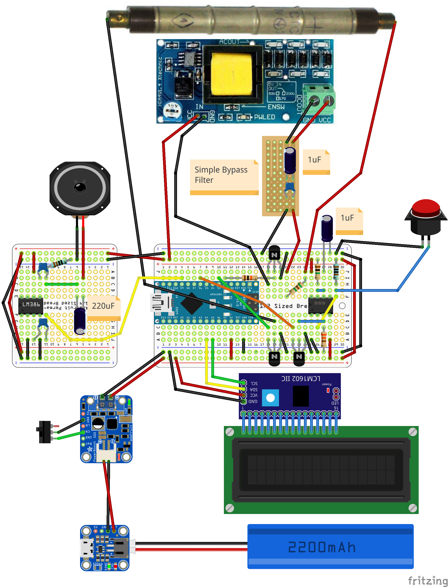
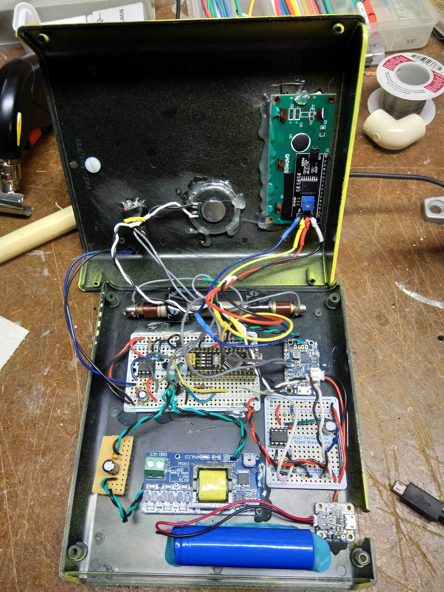
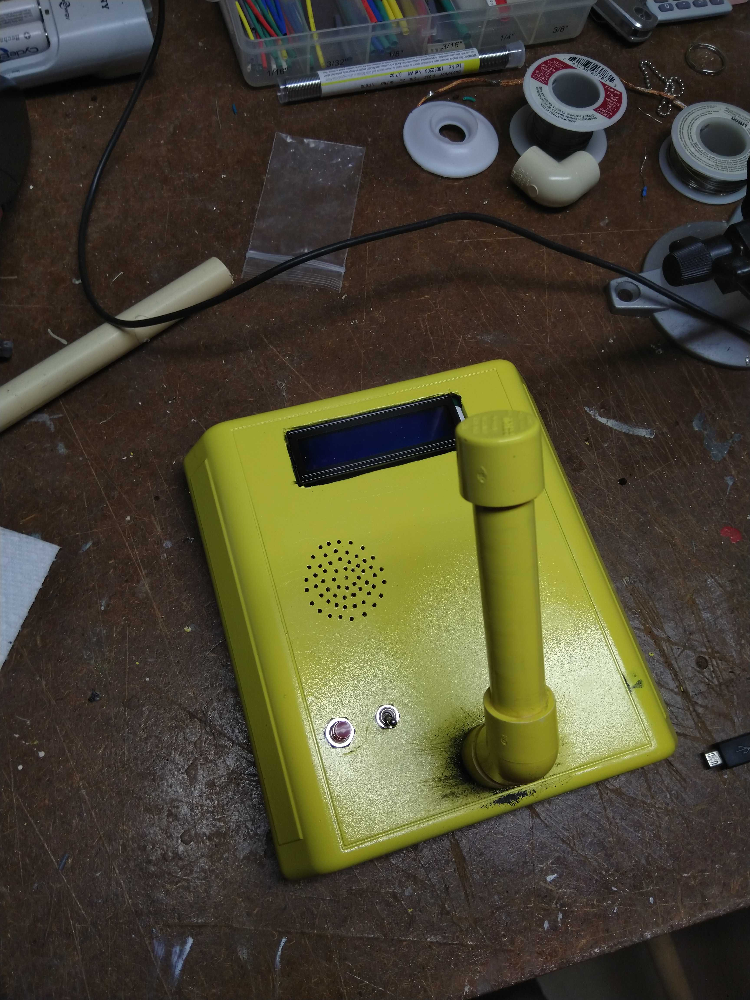

# Geiger
This is a simple geiger counter that I made back in 2019-2020 using an Soviet STS-5 geiger tube and an Arduino Nano. 

The red button changes the interval at which the geiger counter calculates CPM and microSieverts.

## Wiring Diagram

## Images
 
